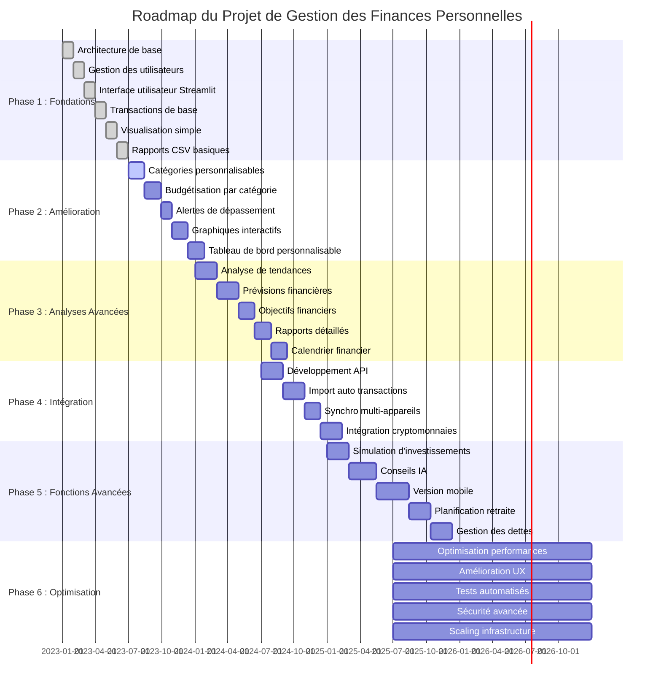

# Application de Gestion des Finances Personnelles

## Description du Projet

Cette application Python est conçue pour la gestion des finances personnelles. Elle permet aux utilisateurs de suivre leurs revenus, dépenses et de gérer leurs budgets. L'application offre une interface utilisateur intuitive construite avec Streamlit.

## Architecture du Projet

```
finance_app/
│
├── app.py                  # Interface utilisateur Streamlit
├── main.py                 # Point d'entrée de l'application
├── config.py               # Configuration globale
│
├── utils/                  # Utilitaires
│   ├── file_handlers.py
│   └── data_processing.py
│
├── models/                 # Modèles de données
│   ├── user.py
│   ├── transaction.py
│   └── budget.py
│
├── services/               # Services métier
│   ├── app_controller.py
│   ├── finance_manager.py
│   ├── budget_manager.py
│   └── user_manager.py
│
└── data/                   # Stockage des données
    └── user_data.json
```

## Fonctionnalités Principales

1. Gestion des utilisateurs
   - Création de compte
   - Connexion/Déconnexion
   - Persistance de session

2. Gestion des finances personnelles
   - Ajout de transactions (revenus et dépenses)
   - Catégorisation des transactions
   - Affichage du solde actuel

3. Visualisation des données
   - Affichage des transactions récentes
   - Graphiques de répartition des dépenses et revenus

4. Génération de rapports
   - Export des données financières au format CSV

## Installation

1. Clonez le repository
2. Créez un environnement virtuel : `python -m venv venv`
3. Activez l'environnement virtuel :
   - Windows : `venv\Scripts\activate`
   - Unix ou MacOS : `source venv/bin/activate`
4. Installez les dépendances : `pip install -r requirements.txt`
5. Lancez l'application : `streamlit run app.py`

## Dépendances

Les principales dépendances du projet sont :

- Streamlit : Interface utilisateur web
- Pandas : Manipulation et analyse de données
- Matplotlib : Création de graphiques
- Python-dateutil : Manipulation avancée des dates

Voir `requirements.txt` pour la liste complète et les versions spécifiques des dépendances.

## Utilisation

1. Lancez l'application avec `streamlit run app.py`
2. Créez un compte ou connectez-vous
3. Utilisez l'interface pour ajouter des transactions, visualiser vos finances, et générer des rapports

## Développement Futur

## Roadmap du Projet



## Contribution

Les contributions sont les bienvenues ! N'hésitez pas à forker le projet, créer une branche, et soumettre une pull request.
